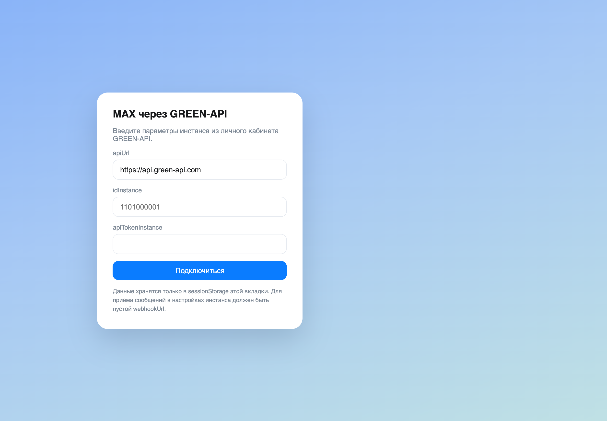
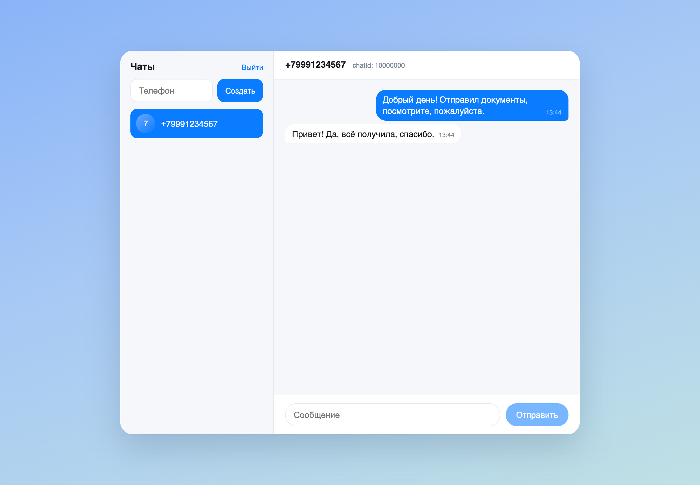
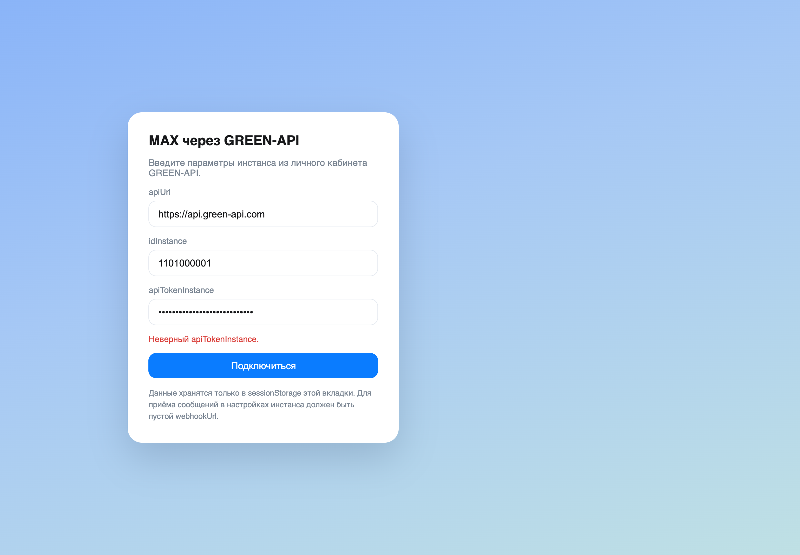

# MAX через GREEN-API

Одностраничное приложение для переписки в мессенджере MAX через [GREEN-API](https://green-api.com/max):
отправка текстовых сообщений методом SendMessage и приём входящих по технологии HTTP API
(ReceiveNotification + DeleteNotification).

Внешний вид чата ориентирован на [web.max.ru](https://web.max.ru/). Поддерживаются только текстовые сообщения.

Демо: https://hayk11111.github.io/green-api-chat/




## Что нужно до запуска

1. Мобильное приложение MAX на телефоне, авторизованное по номеру.
2. Инстанс в [личном кабинете GREEN-API](https://console.green-api.com/), авторизованный по QR-коду.
   Состояние инстанса должно быть `authorized` — приложение проверяет это методом GetStateInstance при входе.
3. Пустой `webhookUrl` в настройках инстанса. Без этого ReceiveNotification вернёт ошибку
   `Message cannot be received because custom webhook url is set`.

   Очистить можно в личном кабинете (кнопка «Изменить» на панели инстанса) или методом
   [SetSettings](https://green-api.com/v3/docs/api/account/SetSettings/):

   ```bash
   curl --location '{apiUrl}/waInstance{idInstance}/setSettings/{apiTokenInstance}' \
     --header 'Content-Type: application/json' \
     --data '{"webhookUrl": "", "incomingWebhook": "yes", "outgoingWebhook": "yes", "stateWebhook": "yes"}'
   ```

   После изменения настроек инстанс перезапускается, нужно подождать около минуты.

4. Параметры доступа из личного кабинета: `apiUrl`, `idInstance`, `apiTokenInstance`.
   У инстанса может быть свой хост вида `https://3100.api.green-api.com`, поэтому `apiUrl` вводится в форме;
   по умолчанию подставляется `https://api.green-api.com`.

Реквизиты вводятся в интерфейсе и хранятся только в `sessionStorage` вкладки. В репозитории их нет.

## Запуск

```bash
npm install
npm run dev
```

Приложение откроется на http://localhost:5173/green-api-chat/

Сборка и локальный просмотр собранной версии:

```bash
npm run build
npm run preview
```

## Публикация на GitHub Pages

Собранная версия лежит в ветке `gh-pages`, в `vite.config.ts` задан `base: '/green-api-chat/'`.
Обновление публикации:

```bash
npm run build
git worktree add /tmp/ghp gh-pages
cp -R dist/. /tmp/ghp/
cd /tmp/ghp && git add -A && git commit -m "publish build" && git push
```

## Как пользоваться

1. Ввести `apiUrl`, `idInstance` и `apiTokenInstance`, нажать «Подключиться».
2. Ввести номер получателя в международном формате (11–12 цифр) и нажать «Создать».
   Номер проверяется методом CheckAccount, из ответа берётся `chatId`.
3. Написать текст и отправить. Ответ собеседника появится в чате в течение нескольких секунд.

GREEN-API принимает номера только для кодов стран 7 (РФ) и 375 (РБ).

## Архитектура

Приложение полностью клиентское, без бэкенда: GREEN-API отдаёт `Access-Control-Allow-Origin: *`
и разрешает методы `GET, POST, OPTIONS, DELETE`, поэтому браузер обращается к API напрямую.

- `src/api.ts` — запросы к GREEN-API и разбор ошибок. Адрес собирается как
  `{apiUrl}/waInstance{idInstance}/{method}/{apiTokenInstance}`. Ответ читается как текст:
  ReceiveNotification при пустой очереди возвращает `null`, а ошибки вроде 401 приходят с пустым телом,
  поэтому `response.json()` здесь не годится.
- `src/useNotifications.ts` — цикл получения входящих. ReceiveNotification вызывается с
  `receiveTimeout=20`: сервер держит соединение до появления уведомления, отдельный таймер опроса не нужен.
  После обработки уведомление подтверждается методом DeleteNotification по `receiptId`, иначе очередь
  не сдвинется. При ошибке цикл ждёт 5 секунд и повторяет запрос; текст ошибки показывается в интерфейсе.
- `src/App.tsx` — состояние чатов и сообщений. Из входящих уведомлений берутся только
  `incomingMessageReceived` с `typeMessage: "textMessage"`; чат заводится автоматически, если сообщение
  пришло из неизвестного `chatId`. Повторы отсекаются по `idMessage`.
- `src/components/` — форма реквизитов, список чатов, переписка.

Зависимости: React, Vite, TypeScript. Внешних библиотек для состояния, UI и HTTP нет — хватает
`useState`, обычного CSS и `fetch`.

## Статус проверки

Сборка, проверка типов и работа интерфейса в браузере проверены. Ошибки API выводятся в интерфейсе:



Сквозная проверка с реальной отправкой и приёмом сообщения не выполнялась: на момент сдачи не было
оплаченного инстанса GREEN-API. Формат запросов сверялся с документацией MAX API.
